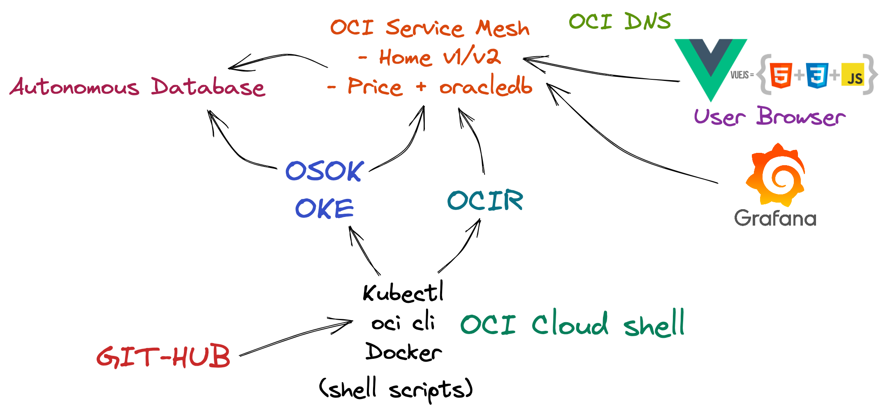
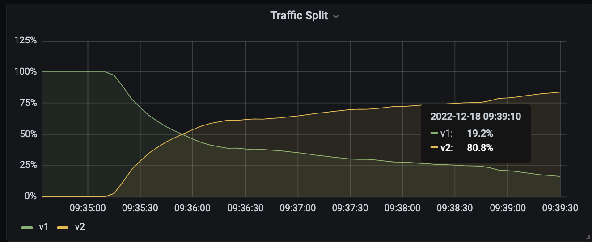
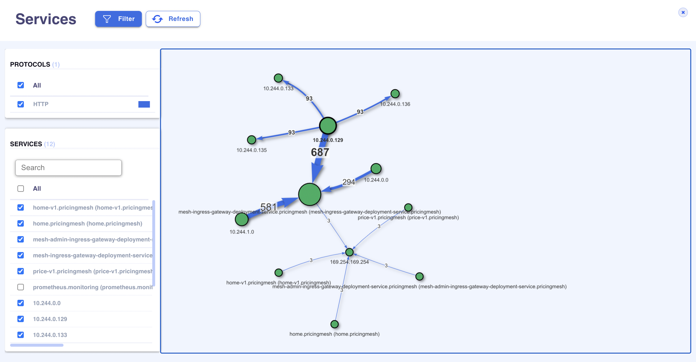

# arch-oci-mesh

 

## THIS IS A NEW, BLANK REPO THAT IS NOT READY FOR USE YET.  PLEASE CHECK BACK SOON!

## Introduction

Create OCI Service Mesh for VueJS SPA, NodeJS microservices and Autonomous Database using OCI Cloud Shell and kubectl

## Getting Started

Have Oracle Oracle Kubernetes Engine (OKE) cluster up and running with <code>kubectl</code> access from OCI Cloud shell

Install Oracle Services Operator for Kubernetes (OSOK) to your OKE cluster, see <a href="https://github.com/oracle/oci-service-operator/blob/main/docs/installation.md#install-operator-sdk">
https://github.com/oracle/oci-service-operator/blob/main/docs/installation.md#install-operator-sdk</a>

    

Open Cloud shell from OCI Console
    

Run
<pre>
git clone https://github.com/mikarinneoracle/oci-service-mesh.git
cd oci-service-mesh
</pre>

## Setup environment

Run
<pre>
export mesh_name=pricing
export mesh_compartment=ocid1.compartment.oc1..
export ca_ocid=ocid1.certificateauthority.oc1.eu-amsterdam-1.amaaaa...
export ocir=&lt;YOUR REGION OCIR HERE&gt;/&lt;YOUR TENANCY NAME HERE&gt; e.g. ams.ocir.io/frsxwtjslf75
export dns_domain=&lt;YOUR MESH DNS DOMAIN HERE&gt; e.g. mymesh.mysite.com
</pre>

Check out mesh documentation for <a href="https://docs.oracle.com/en-us/iaas/Content/service-mesh/ovr-getting-started-osok.htm#service-mesh-getting-install-osok">setting up the CA</a>.

<i>Note</i>: Run Cloud shell in the same region as the <code>&lt;YOUR REGION OCIR HERE&gt;</code> above.

## Login to OCIR

To use image repos in OCIR images run
<pre>
export docker_username='&lt;YOUR TENANCY NAME HERE&gt;/oracleidentitycloudservice/&lt;YOUR USER NAME HERE&gt;'
export docker_password='&lt;YOUR ACCESS TOKEN HERE&gt;'

docker login ${ocir} -u ${docker_username} -p ${docker_password}
</pre>

This will also later create <code>ocirsecret</code> for OKE to access the image repos when <a href="#deploy-services-to-oke-using-kubectl">deploying the services</a>.

## Create Autonomous Database using kubectl (with OSOK)

Run <code>sh create_atp.sh pricemeshdb &lt;YOUR ADB PASSWORD HERE&gt;</code>

e.g. <code>sh create_atp.sh pricemeshdb RockenRoll321#!</code>

<code>&lt;YOUR ADB PASSWORD HERE&gt;</code> needs to be a valid Autonomous database password, see <a href="https://docs.public.oneportal.content.oci.oraclecloud.com/en-us/iaas/exadata/doc/adb-managing-adb.html#GUID-F6EF6907-3694-4655-AEA1-2691ADFC8E39">here for details</a>.
    

Test your ADB instance is alive and accessible:
    
<pre>
kubectl get AutonomousDatabases -n ${mesh_name}
</pre>

## Create microservices registries using oci cli (or Cloud UI for OCIR)

Run
<pre>
oci artifacts container repository create -c ${mesh_compartment} --display-name ${mesh_name}-homesvc
oci artifacts container repository create -c ${mesh_compartment} --display-name ${mesh_name}-pricesvc
</pre>

Additonally use <code>--is-public</code> flag in the statements above if you want to use <i>public</i> repos.

## Build services and push to OCIR

Build will build and push 2 microservices, <code>home</code> and <code>price</code>.

<code>home</code> is the application's Homepage that has two versions, <code>v1</code> and <code>v2</code> that will be load balanced by the mesh with <b>20/80</b> <code>rule</code> later. <code>v1</code> is a static homepage and <code>v2</code> is  a dynamic one that will then access prices from Autonomous Database using <code>price</code> service with JSON.

Before building services download <a href="https://download.oracle.com/otn_software/linux/instantclient/217000/instantclient-basic-linux.x64-21.7.0.0.0dbru.zip">https://download.oracle.com/otn_software/linux/instantclient/217000/instantclient-basic-linux.x64-21.7.0.0.0dbru.zip</a> to this project's root directory.

e.g. <code>wget https://download.oracle.com/otn_software/linux/instantclient/217000/instantclient-basic-linux.x64-21.7.0.0.0dbru.zip</code>
    

This is needed for the NodeJS <code>oracledb</code> library to access the Autonomous database from the <code>price</code> microservice.

Run <code>sh build_services.sh pricemeshdb &lt;YOUR ADB PASSWORD HERE&gt;</code>
    

e.g. <code>sh build_services.sh pricemeshdb RockenRoll321#!</code>

## Deploy services to OKE using kubectl

Run <code>sh deploy_services.sh</code>

View the deployments created <code>kubectl get deployments -n ${mesh_name} -o wide</code>
   

View services created <code>kubectl get services -n ${mesh_name}</code>

## Create Service Mesh using the built and deployed services using kubectl

Run <code>sh meshify_app.sh</code>

Monitor pods being updated - this will take several minutes to happen

<code>kubectl get pods -n ${mesh_name} --watch</code>
   

View services being updated <code>kubectl get services -n ${mesh_name} --watch</code>

## Access mesh and the NodeJS microservices running in it

### Create/Update DNS using oci cli

<i>Note</i>: Accessing mesh via OCI DNS requires a valid registered domain in order to be functional. Use the local configuration option instead if such is not available.

By default DNS zone will run in the same compartment as the mesh. However, if you want to specify another compartment for the DSN, run
<pre>
export dns_compartment=ocid1.compartment.oc1..
</pre>

Pick up the LodBalancer <code>EXTERNAL-IP</code> addresses and them to DNS Zone by running

<code>kubectl get services -n ${mesh_name}</code>

Then create/update DNS by running
<pre>
sh update_dns.sh home &lt;YOUR REGION HERE&gt; <i>mesh-ingress-ip</i>
sh update_dns.sh admin &lt;YOUR REGION HERE&gt; <i>mesh-ingress-admin-ip</i>
</pre>

e.g.
<pre>
sh update_dns.sh home eu-amsterdam-1 158.101.210.63
sh update_dns.sh admin eu-amsterdam-1 158.101.211.252
</pre>

### Use local config instead of OCI DNS

Alternatively open your local <code>/etc/hosts</code> file and add the following to acesss the mesh (example)
<pre>
158.101.210.63 home.mymesh.mysite.com
158.101.211.252 admin.mymesh.mysite.com
</pre>

## Create Monitoring using oci cli and kubectl
Create Logging Dynamic Group and the Log Object

See <a href="https://docs.oracle.com/en-us/iaas/Content/service-mesh-tutorials/service-mesh-overview/00-overview.htm">https://docs.oracle.com/en-us/iaas/Content/service-mesh-tutorials/service-mesh-overview/00-overview.htm</a>

Monitoring pods and services will be created in <code>monitoring</code> namespace

<pre>
export log_object_ocid=ocid1.log.oc1.eu-amsterdam-1.amaaaa.....
export logging_dynamicgroup_ocid=ocid1.dynamicgroup.oc1..
</pre>

Run <code>sh create_monitoring.sh</code>

<i>Note</i>: <code>Log object</code> above is expected to run in the same region you used in earlier steps.

Monitor services being created <code>kubectl get services -n monitoring --watch</code>

Once the Grafana <code>EXTERNAL-IP</code> shows up, copy it and open in browser to monitor the mesh using Grafana.

## Testing

    Access the <code>home.&lt;YOUR MESH DNS DOMAIN HERE&gt;</code> e.g. <code>home.mymesh.mysite.com</code> from browser.
Reload the page multiple times to see traffic split happening by the 20/80 rule to the homepage.
View Grafana for the same.

Access "price admin" of <code>price</code> microservice from the <i>Admin</i> -link on the homepage.
Admin <b>user</b> is <code>priceadmin</code> and <b>password</b> is <code>&lt;YOUR ADB PASSWORD&gt;</code> e.g. 
<code>RockenRoll321#!</code>. Edit prices and options and then save and reload the homepage to see the values on Homepage chancing.
   
### Home routing testing

To test changes in home routing first run

<pre> sh update_home_routing.sh 100 0</pre>

Wait for a while and see traffic going to static homepage (v1) only. You can also view this from the mesh config on Cloud UI.

<i>Note</i>: The <i>sum</i> of the given routing values needs to be <b>100</b>

Then run

<pre> sh update_home_routing.sh 20 80</pre>

Wait for a while and see traffic going back to both static (v1) and dynamic (v2) homepage with the 20/80 split.

See the traffic split to change in Grafana:

## Viewing traffic with Kubeshark

Install kubeshark locally from <a href="https://kubeshark.co/">https://kubeshark.co/</a>

Start capturing traffic and visit <code>localhost:8899</code> to view real time streaming traffic:

<pre>
kubeshark tap -n &lt;YOUR MESH NAME HERE&gt;
</pre>

e.g.
<pre>
kubeshark tap -n pricing
</pre>    

Navigate to your local browser for the Kubeshark views like the service map:

    

<i>Note</i>: OCI Service Mesh OKE cluster access with kubectl need to be setup locally for the Kubeshark accesss

### Prerequisites

OKE cluster with kubectl access in Cloud Shell

## Notes/Issues

## URLs
https://github.com/oracle/oci-service-operator/blob/main/docs/installation.md#install-operator-sdk

## Contributing
This project is open source.  Please submit your contributions by forking this repository and submitting a pull request!  Oracle appreciates any contributions that are made by the open source community.

## License
Copyright (c) 2022 Oracle and/or its affiliates.

Licensed under the Universal Permissive License (UPL), Version 1.0.

See [LICENSE](LICENSE) for more details.

ORACLE AND ITS AFFILIATES DO NOT PROVIDE ANY WARRANTY WHATSOEVER, EXPRESS OR IMPLIED, FOR ANY SOFTWARE, MATERIAL OR CONTENT OF ANY KIND CONTAINED OR PRODUCED WITHIN THIS REPOSITORY, AND IN PARTICULAR SPECIFICALLY DISCLAIM ANY AND ALL IMPLIED WARRANTIES OF TITLE, NON-INFRINGEMENT, MERCHANTABILITY, AND FITNESS FOR A PARTICULAR PURPOSE.  FURTHERMORE, ORACLE AND ITS AFFILIATES DO NOT REPRESENT THAT ANY CUSTOMARY SECURITY REVIEW HAS BEEN PERFORMED WITH RESPECT TO ANY SOFTWARE, MATERIAL OR CONTENT CONTAINED OR PRODUCED WITHIN THIS REPOSITORY. IN ADDITION, AND WITHOUT LIMITING THE FOREGOING, THIRD PARTIES MAY HAVE POSTED SOFTWARE, MATERIAL OR CONTENT TO THIS REPOSITORY WITHOUT ANY REVIEW. USE AT YOUR OWN RISK. 